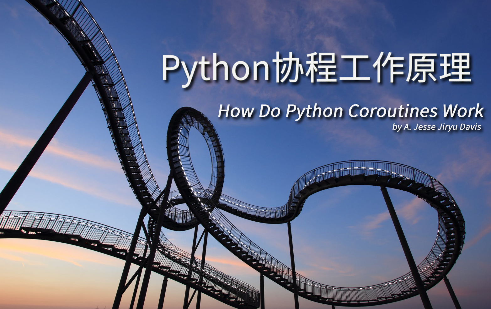

# How Do Python Coroutines Work

Source: https://www.youtube.com/watch?v=7sCu4gEjH5I

By:  [A. Jesse Jiryu Davis](https://www.youtube.com/channel/UC5MSR011tHgM7cL3LL83DUQ)

Code: https://github.com/ajdavis/coroutines-demo

ENG&CHN Subtitles：[How Do Python Coroutines Work.ass](https://github.com/ClausewitzCPU0/Subtitles/blob/master/Python/How%20Do%20Python%20Coroutines%20Work/How%20Do%20Python%20Coroutines%20Work.ass)

ENG Subtitles：[ENG.ass](https://github.com/ClausewitzCPU0/Subtitles/blob/master/Python/How%20Do%20Python%20Coroutines%20Work/ENG.ass)

CHN Subtitles：[CHN.ass](https://github.com/ClausewitzCPU0/Subtitles/blob/master/Python/How%20Do%20Python%20Coroutines%20Work/CHN.ass)

------

Cover made by: [PolestarX](https://github.com/ClausewitzCPU0)

Picture(free for commercial use): https://www.pexels.com/photo/black-and-white-roller-coaster-106155/

## Index

| Time  | Contents                                          |
| ----- | ------------------------------------------------- |
| 0:00  | abstract                                          |
| 3:06  | basic blocking framework                          |
| 6:50  | async framework                                   |
| 12:42 | callbacks                                         |
| 14:48 | eventloop                                         |
| 21:02 | quit loop                                         |
| 25:02 | coroutines                                        |
| 28:46 | Future class & little refresher about generators. |
| 34:12 | Task class                                        |

### 关于作者

A. Jesse Jiryu Davis 是纽约 MongoDB 的工程师。他编写了异步 MongoDB Python 驱动程序 Motor，也是 MongoDB C 驱动程序的开发领袖和 PyMongo 团队成员。 他也为 asyncio 和 Tornado 做了贡献，在 [http://emptysqua.re](http://emptysqua.re/) 上写作。

作者和Python之父Guido van Rossum 合作过一篇关于协程的文章，中文翻译链接如下：

https://linux.cn/article-8265-1.html